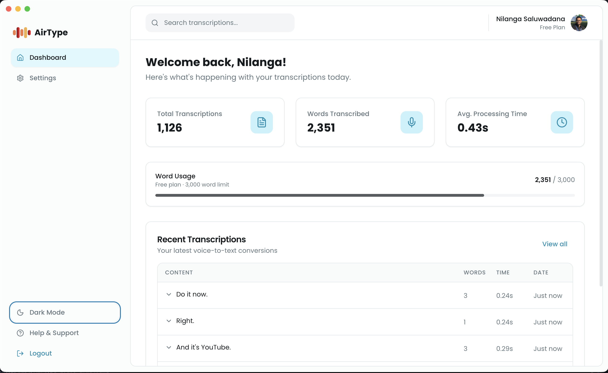
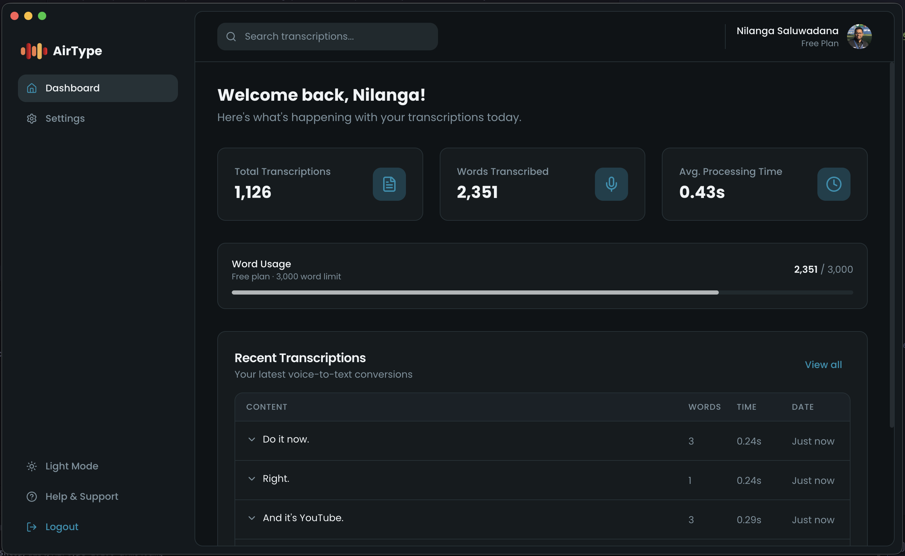

# AirType - AI-Powered Voice Dictation

Production-ready voice dictation application with Google OAuth authentication, built with Go backend and Electron desktop app.

## Features

- 🎤 **Voice-to-Text** - Groq Whisper Large v3 Turbo for fast, accurate transcription
- 🤖 **AI Cleanup** - Filler removal, punctuation, and formatting via Groq Llama 4 Scout
- 🌐 **Multi-language** - 12 languages supported end-to-end (transcription + cleanup)
- 🔐 **Google OAuth** - Exchange-code auth flow with nonce-validated redirect
- ⚡ **Low-latency hot path** - Desktop calls Groq directly; backend only for auth + storage
- 🖥️ **Cross-platform** - Native desktop apps for Mac (signed builds) and Windows
- ⌨️ **Global push-to-talk** - Hold `fn` key to record via a macOS CGEventTap native module
- 📝 **Auto-paste** - Simulated `Cmd+V` injects cleaned text at your cursor
- 🎯 **Jargon-preserving** - Cleanup prompt keeps proper nouns, brand names, and code verbatim
- 📊 **Usage tracking** - Dashboard with transcription history and stats
- 💳 **Free plan** - 3,000 words/month included

## Screenshots

| Light | Dark |
|---|---|
|  |  |

## Tech Stack

### Backend
- **Go** (Gin) - High-performance API server
- **MongoDB** - NoSQL database for users, transcriptions, settings
- **Groq API** - Whisper Large v3 Turbo (STT) + Llama 4 Scout (cleanup)
- **Google OAuth 2.0** - Authentication with exchange-code + client-nonce flow
- **JWT** - Stateless token-based auth; 32-byte secret minimum enforced at startup

### Desktop App
- **Electron** - Cross-platform desktop framework
- **React + TypeScript** - UI framework
- **Vite** - Build tool
- **electron-store** - Local persistence for tokens and settings
- **Native C++/Objective-C module** - macOS `fn` key capture via CGEventTap

## Project Structure

```
airtype/
├── backend/           # Go API server
├── desktop/           # Electron desktop app
├── infrastructure/    # Docker & deployment configs
└── docker-compose.yml # Local development setup
```

## Quick Start

### Prerequisites

- **Go 1.21+**
- **Node.js 18+**
- **MongoDB 6.0+**
- **Groq API Key** - Get from https://console.groq.com
- **Google OAuth Credentials** - Get from https://console.cloud.google.com

### 1. Clone and Install

```bash
# Clone repository
git clone https://github.com/codecube47/airtype.git
cd airtype

# Start dependencies with Docker
docker-compose up -d mongodb

# Install backend dependencies
cd backend
go mod download

# Install desktop dependencies
cd ../desktop
npm install
```

### 2. Configure Environment

```bash
# Backend - create backend/.env
cp backend/.env.example backend/.env

# Edit backend/.env with your credentials:
# - GOOGLE_CLIENT_ID
# - GOOGLE_CLIENT_SECRET
# - GROQ_API_KEY
# - JWT_SECRET (generate with: openssl rand -base64 32)
```

### 3. Run Development

```bash
# Terminal 1: Start backend
cd backend
go run cmd/server/main.go

# Terminal 2: Start desktop app
cd desktop
npm run dev
```

### 4. Google OAuth Setup

1. Go to https://console.cloud.google.com
2. Create new project "AirType"
3. Enable "Google+ API"
4. Create OAuth 2.0 credentials:
   - Application type: **Web application**
   - Authorized redirect URIs: `http://localhost:3001/api/auth/google/callback`
5. Copy Client ID and Client Secret to `backend/.env`

## API Endpoints

### Authentication
- `GET /api/auth/google/login?clientNonce=<nonce>` - Get Google OAuth URL. `clientNonce` is echoed back in the airtype:// redirect and validated by the desktop app as a CSRF defense against reflected protocol invocations.
- `GET /api/auth/google/callback` - OAuth callback handler. Redirects to `airtype://auth/callback?code=<exchange_code>&nonce=<clientNonce>` — **tokens are NOT put in the redirect URL**.
- `POST /api/auth/exchange` - One-time redemption of exchange code for `{accessToken, refreshToken}`. Code is single-use and expires after 2 minutes.
- `POST /api/auth/refresh` - Refresh access token (rejects suspended users).
- `GET /api/auth/me` - Get current user (protected).

### Transcription
- `POST /api/transcribe` - Upload audio, get transcription (protected, rate-limited: 30 req/min per user, burst 10).
- `POST /api/transcriptions/save` - Save a pre-transcribed result from direct Groq calls (protected, rate-limited: same limits).
- `GET /api/transcriptions?page=N&limit=M` - Paginated history (protected).
- `GET /api/transcriptions/stats` - Aggregate stats + free-plan usage (protected).

### User / Settings
- `GET /api/settings` - Get user settings (language, autoFormat, removeFillers, customPrompt).
- `PUT /api/settings` - Update settings. Debounced-synced from the desktop app.
- `GET /api/config` - Returns Groq API credentials + cleanup prompt for the desktop to call Groq directly (protected). **Note:** this exposes the shared `GROQ_API_KEY` to authenticated clients — a deliberate tradeoff to keep audio out of the backend on the hot path.

## Security Notes

- **JWT_SECRET minimum length**: 32 bytes enforced at startup. Server refuses to boot with a weaker secret.
- **OAuth flow**: exchange-code + client-nonce (tokens never appear in redirect URL, browser history, or server access logs).
- **Rate limiting**: in-memory per-user token bucket on transcription endpoints. Swap for Redis if horizontally scaled.
- **Token storage (desktop)**: `electron-store` with a passphrase — this is obfuscation, not true encryption. Acceptable for a single-user desktop context, not for shared machines.
- **Prompt injection**: user-dictated text is wrapped in `<<< … >>>` delimiters before the LLM call, and the cleanup prompt instructs the model to treat those contents as data only.

## Development

### Backend Development

```bash
cd backend

# Run with hot reload
go install github.com/cosmtrek/air@latest
air

# Run tests
go test ./...

# Format code
go fmt ./...

# Lint
golangci-lint run
```

### Desktop Development

```bash
cd desktop

# Development mode
npm run dev

# Build for production
npm run build

# Package for distribution
npm run package
```

## Docker Development

```bash
# Start all services
docker-compose up -d

# View logs
docker-compose logs -f

# Stop all services
docker-compose down
```

## Production Deployment

### Backend Deployment (Railway)

Railway is the recommended platform for deploying the backend. Build is Dockerfile-based ([backend/Dockerfile](./backend/Dockerfile)), healthcheck is `/health`, config lives in [backend/railway.json](./backend/railway.json).

#### First-time bootstrap: `./deploy.sh`

Use [backend/deploy.sh](./backend/deploy.sh) for the initial deploy. It reads `backend/.env.prod`, links (or creates) a Railway project, provisions MongoDB, syncs every `GOOGLE_*` / `GROQ_*` / `JWT_*` variable, generates the Railway domain, and sets `GOOGLE_REDIRECT_URL` automatically.

```bash
brew install railway       # or: npm install -g @railway/cli
railway login
cd backend
./deploy.sh
```

> ⚠️ `deploy.sh` falls back to `JWT_SECRET=$(openssl rand -base64 32)` if `.env.prod` doesn't define one. If you re-run `deploy.sh` later **without** a `JWT_SECRET` line in `.env.prod`, it regenerates the secret — invalidating every existing user's session. For routine re-deploys, use `railway up` below, not `./deploy.sh`.

#### Routine re-deploy: `railway up`

Once the project is linked and variables are set, the minimal redeploy is:

```bash
cd backend
railway up            # or: railway up --detach (don't stream logs)
railway logs --build  # watch the Docker build
railway logs          # runtime logs after deploy
```

This ships the current working tree (no git push required), doesn't touch environment variables, and avoids the JWT_SECRET regeneration risk above.

#### Alternative: Deploy via GitHub

1. Push your code to GitHub
2. Go to [railway.app](https://railway.app) and sign in
3. Create New Project → Deploy from GitHub repo
4. Set root directory to `backend`
5. Add MongoDB from the Railway dashboard
6. Set environment variables in the dashboard

#### After Deployment

1. **Update Google OAuth**: Add your Railway URL to [Google Cloud Console](https://console.cloud.google.com):
   - Authorized redirect URIs: `https://your-app.railway.app/api/auth/google/callback`

2. **Update Desktop App**: Edit `desktop/.env.production` (this is the file Vite reads for `--mode production` builds; `desktop/.env` is dev-only):
   ```
   VITE_API_URL=https://your-app.railway.app/api
   ```

3. Rebuild the desktop app (`make package-mac`) — the URL is baked into the packaged bundle.

#### Useful Railway Commands

```bash
railway logs      # View logs
railway open      # Open dashboard
railway up        # Deploy changes
railway status    # Check deployment status
```

### Alternative: Build Binary Locally

```bash
cd backend

# Build for current platform
go build -o airtype-server cmd/server/main.go

# Build for Linux (cloud servers)
CGO_ENABLED=0 GOOS=linux GOARCH=amd64 go build -o airtype-server cmd/server/main.go

# Build with Docker
docker build -t airtype-api .
docker run -p 3001:3001 --env-file .env airtype-api
```

---

### Desktop App Distribution

Use the root [Makefile](./Makefile) targets — they rebuild the native `fn_key.node` module for the target arch before packaging (critical if you've recently built on a different arch).

**Prerequisite**: [desktop/.env.production](./desktop/.env.production) must define `VITE_API_URL` pointing at your deployed backend. Without it, the packaged build silently falls back to `http://localhost:3001/api`.

#### Build for macOS

```bash
# Apple Silicon (default on M-series hosts)
make package-mac

# Intel Mac (from an Apple Silicon host, explicit --arch=x64 for native + electron-builder)
make package-mac-x64

# Output: desktop/dist/
# - AirType-<version>-arm64.dmg    (or -x64.dmg)
# - AirType-<version>-arm64.zip
# - mac-arm64/AirType.app          (runnable bundle, no install)
```

`<version>` is whatever is in [desktop/package.json](./desktop/package.json) (currently `1.1.0`).

The `make package-mac` flow is equivalent to `cd desktop && npm run package:mac`, but adds `make native` as a dependency so the fn-key native module is rebuilt first. Prefer the Makefile — `npm run electron:build` skips the native rebuild.

#### Build for Windows

```bash
make package-win

# Output: desktop/dist/
# - AirType Setup <version>.exe   (NSIS installer)
# - AirType <version>.exe         (portable build)
```

Windows packaging requires Windows host or Wine on macOS/Linux.

#### Code signing & notarization (macOS)

`electron-builder` will auto-sign with a local Developer ID if one is available in the keychain, but skips notarization unless these env vars are set:

```bash
export APPLE_ID=your@email.com
export APPLE_APP_SPECIFIC_PASSWORD=xxxx-xxxx-xxxx-xxxx
export APPLE_TEAM_ID=XXXXXXXXXX
make package-mac
```

Without notarization, first-launch on other Macs hits a Gatekeeper warning (right-click → Open to bypass).

#### macOS Permissions

The packaged app requires these permissions (users must grant manually):

1. **System Settings → Privacy & Security → Microphone**
   - Enable for AirType

2. **System Settings → Privacy & Security → Accessibility**
   - Enable for AirType (required for fn key hotkey and text paste)

---

### Production Checklist

- [ ] Backend deployed to Railway (or other cloud)
- [ ] MongoDB database provisioned
- [ ] Environment variables set on server
- [ ] Google OAuth redirect URI updated for production URL
- [ ] `desktop/.env.production` updated with production `VITE_API_URL`
- [ ] Desktop app rebuilt with production config (`make package-mac`)
- [ ] macOS app signed and notarized (optional)
- [ ] Test login flow end-to-end
- [ ] Test transcription with fn key

## Environment Variables

### Backend (.env)

```bash
# Server
PORT=3001
ENV=development

# MongoDB
MONGODB_URI=mongodb://localhost:27017
MONGODB_DB=airtype

# JWT
JWT_SECRET=your-super-secret-key-min-32-chars

# Google OAuth
GOOGLE_CLIENT_ID=your-client-id.apps.googleusercontent.com
GOOGLE_CLIENT_SECRET=GOCSPX-your-secret
GOOGLE_REDIRECT_URL=http://localhost:3001/api/auth/google/callback

# Groq
GROQ_API_KEY=gsk_your_api_key_here

# Desktop
DESKTOP_CALLBACK_URL=airtype://auth/callback
```

## Architecture

### Authentication Flow

1. User clicks "Sign in with Google"
2. Desktop main process generates a random `clientNonce`, persists it to `electron-store`, and fetches the OAuth URL from `/api/auth/google/login?clientNonce=…`
3. Desktop opens the URL in the system browser
4. User authenticates with Google
5. Google redirects to backend `/api/auth/google/callback` with auth code + state
6. Backend validates state, exchanges the Google code for user info, creates/finds the user in MongoDB
7. Backend generates JWT tokens, stores them under a **one-time exchange code** with a 2-minute TTL
8. Backend redirects to `airtype://auth/callback?code=<exchangeCode>&nonce=<clientNonce>` — tokens are NOT in the URL
9. Desktop `open-url` handler validates the nonce against its stored copy, then POSTs `/api/auth/exchange` with the code
10. Desktop saves the returned tokens to `electron-store`

### Transcription Flow

The hot path bypasses the backend entirely. Audio never touches your server; the backend is only involved for post-hoc storage and usage tracking.

1. User holds `fn` key (push-to-talk)
2. Native fn-key module emits `down` → desktop main process forwards to the recording widget
3. Widget starts `MediaRecorder` at 16kHz mono (Opus in WebM)
4. User releases `fn`
5. Widget POSTs audio **directly to `api.groq.com/v1/audio/transcriptions`** (Whisper Large v3 Turbo) — the Groq API key was fetched from `/api/config` on app startup
6. Widget POSTs raw text **directly to `api.groq.com/v1/chat/completions`** (Llama 4 Scout) with the language-aware cleanup prompt
7. Widget simulates `Cmd+V` in the focused app to paste the cleaned text
8. Widget POSTs the raw + cleaned text to `/api/transcriptions/save` **after the paste** (fire-and-forget, doesn't block UX)

## Security

- ✅ **Google OAuth 2.0** - Exchange-code + client-nonce flow; tokens never in redirect URL
- ✅ **JWT tokens** - Stateless API access; suspended users can't refresh
- ⚠️ **Token storage (desktop)** - `electron-store` with a passphrase — obfuscation, not true encryption. Acceptable for single-user desktop context; not for shared machines.
- ✅ **HTTPS only** - All production traffic encrypted; `open-external` IPC rejects non-https schemes
- ✅ **Rate limiting** - Per-user token bucket (30 req/min, burst 10) on transcription endpoints
- ✅ **CORS** - Explicit allowed-origins in production; loud warning in dev fallback
- ✅ **Input validation** - Request bodies validated; 25 MB audio upload cap
- ✅ **Prompt-injection hardened** - User-dictated text is wrapped in `<<< … >>>` delimiters and the cleanup prompt instructs the model to treat those contents as data only

## Contributing

1. Fork the repository
2. Create feature branch (`git checkout -b feature/amazing-feature`)
3. Commit changes (`git commit -m 'Add amazing feature'`)
4. Push to branch (`git push origin feature/amazing-feature`)
5. Open Pull Request

## License

Apache License 2.0 — see [LICENSE](./LICENSE) for the full text.

## Support

- **Documentation**: https://docs.airtype.com
- **Issues**: https://github.com/codecube47/airtype/issues
- **Email**: support@airtype.com

## Supported Languages

End-to-end support (Whisper **and** Llama 4 Scout cleanup) is restricted to the 12 languages Meta officially validates Llama 4 Scout on:

| | | |
|---|---|---|
| English (`en`) | French (`fr`) | Indonesian (`id`) |
| Arabic (`ar`) | German (`de`) | Italian (`it`) |
| Hindi (`hi`) | Portuguese (`pt`) | Spanish (`es`) |
| Tagalog (`tl`) | Thai (`th`) | Vietnamese (`vi`) |

Whisper itself supports ~100 languages. Adding more to the dropdown requires either (a) accepting that cleanup quality may degrade for non-Llama-Scout-supported languages, or (b) swapping to a model with broader coverage (e.g. `llama-3.3-70b-versatile`).

## Roadmap

- [x] ~~Multi-language support~~ — shipped (12 languages, language-aware cleanup prompt)
- [ ] Auto-detect language (tested, reverted; may revisit when detection latency improves)
- [ ] Mobile apps (iOS/Android)
- [ ] Web version
- [ ] Team workspaces
- [ ] Custom vocabulary learning
- [ ] Voice commands ("new line", "delete that")
- [ ] Real-time streaming transcription (blocked: Groq Whisper returns full text, not a stream)
- [ ] Offline mode (local Whisper via whisper.cpp)
- [ ] macOS code signing + notarization for public distribution

---

Built with ❤️ using Go, Electron, and Groq API
